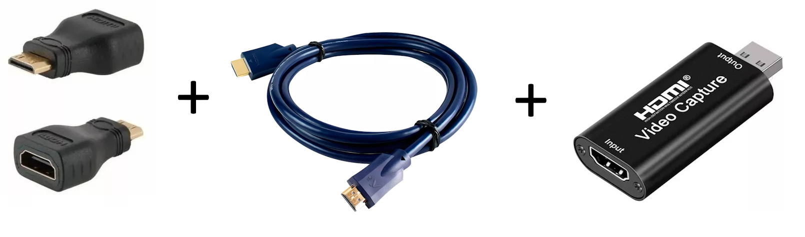
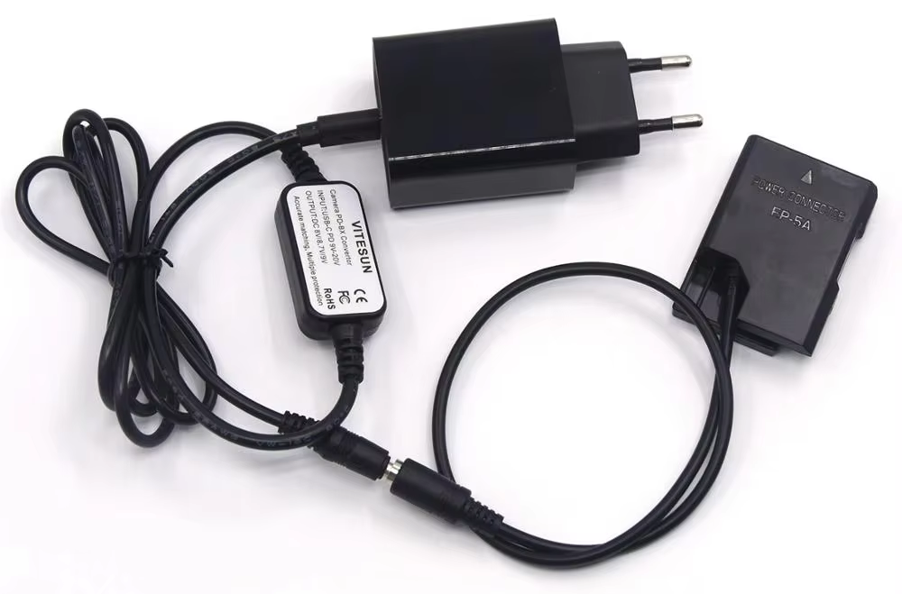

# d5200
Guide on how to use a Nikon D5200 as webcam

First you'll need the HDMI cables and the USB video capture device:

To make things easier on your batteries, get a power supply with battery socket adapter:

Then get the modified firmware (No LiveView Timeout using 15min option) on this repository and load it on your Nikon D5200's root directory.
Select the option to update your firmware and then just connect everything up.
OBS should indentify the video capture device as a camera. 

complete guide found [here](youtube.com/watch?v=EEmr4JErRlc). 
